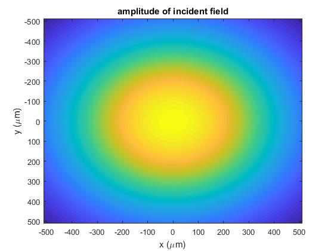
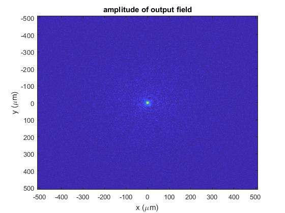

# Beam-Propagation-Method
Our model based on the beam propagation method calculates the wavefront propagation in the scattering medium with the scattering mean free path and anisotropy factor characterized.

To run the code you should:
1. Download all the Matlab files into one folder
2. Run demo.m
3. To modify the optical properties of the biological medium and the incident beam geometry, change the corresponding parameters in ModelSetting.m

After you run the demo.m provided, the input and output wavefront should look like this:

Notes:
1. The layer distance d should be smaller than or equal to the scattering mean free path ls.
2. The anisotropy factor g is not an input parameter but is related to sigma_x.
